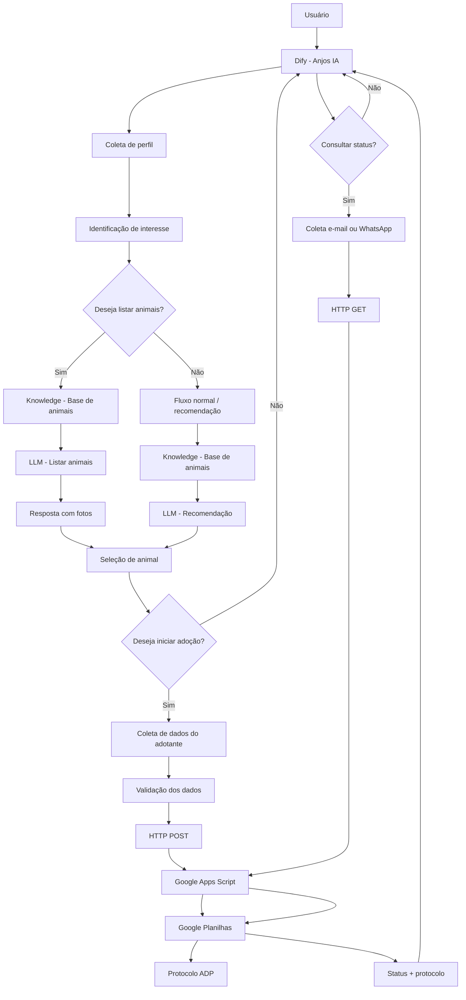
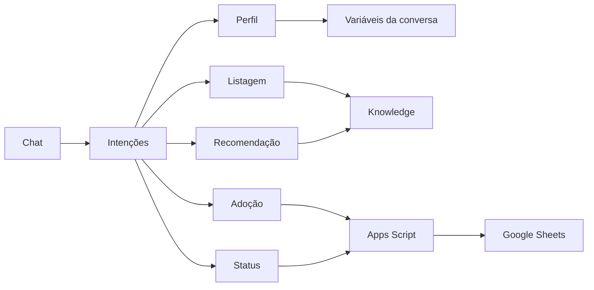

# 11 - Arquitetura e fluxo geral da Anjos IA

## Objetivo

Esta etapa registra a arquitetura atual do MVP da Anjos IA e mostra como os principais módulos do workflow se conectam.

A solução foi construída principalmente no Dify, utilizando um modelo de linguagem, variáveis de conversa, base de conhecimento, decisões condicionais, chamadas HTTP e integração com Google Apps Script e Google Planilhas.

## Visão geral da arquitetura



## Componentes principais

### 1. Interface conversacional

O usuário interage com a Anjos IA pelo chat do Dify.

A entrada principal é a mensagem enviada pelo usuário. A partir dela, o workflow identifica o contexto e decide qual fluxo deve ser executado.

### 2. Coleta de perfil

Responsável por coletar gradualmente informações como:

- espécie;
- porte;
- idade;
- moradia;
- crianças;
- outros animais;
- rotina;
- nível de atividade;
- tempo sozinho;
- existência de quintal.

Os dados são armazenados em variáveis de conversa para serem reutilizados nas etapas seguintes.

### 3. Identificação de intenção

O workflow identifica diferentes intenções do usuário, entre elas:

- conversa normal;
- interesse por um animal específico;
- listagem de animais disponíveis;
- início de adoção;
- consulta de status.

Variáveis de controle:

```text
interesse_animal
listar_animais
quer_iniciar_adocao
consultar_status
```

## 4. Base de conhecimento

A base fictícia de animais é usada pelo módulo Knowledge do Dify.

Ela contém informações como:

- nome;
- espécie;
- porte;
- idade;
- temperamento;
- convivência;
- moradia recomendada;
- saúde;
- vacinação;
- castração;
- status;
- foto.

O LLM deve responder somente com informações recuperadas da base.

## 5. Recomendação

O fluxo de recomendação combina:

```text
perfil do adotante
+
interesse do usuário
+
informações recuperadas da base
```

O objetivo é apresentar opções que possam ser relevantes sem afirmar compatibilidade absoluta.

Quando um animal solicitado não está disponível, o sistema pode oferecer alternativas disponíveis.

## 6. Listagem de animais

Quando `listar_animais = sim`, o fluxo é direcionado para uma busca específica.

O resultado deve:

- apresentar somente animais disponíveis;
- limitar a resposta a até 3 opções;
- incluir foto;
- incluir espécie, porte, idade e descrição;
- usar somente URLs de foto existentes na base.

## 7. Seleção do animal

Após a listagem ou recomendação, o usuário pode escolher um animal específico.

O nome deve ser armazenado em:

```text
interesse_animal
```

Essa variável é necessária para relacionar a solicitação de adoção ao animal escolhido.

## 8. Fluxo de adoção

Quando:

```text
quer_iniciar_adocao = sim
```

o sistema inicia a coleta de:

- nome;
- WhatsApp;
- e-mail, quando fornecido;
- autorização de contato.

A variável `recusou_email` permite concluir o cadastro usando WhatsApp quando o usuário recusa explicitamente o e-mail.

## 9. Persistência da solicitação

Depois da validação dos dados, o Dify envia uma requisição HTTP POST para o Web App do Google Apps Script.

Fluxo:

```text
Dify
  ↓ JSON
Google Apps Script
  ↓
Google Planilhas
```

A planilha armazena a solicitação e o Apps Script cria automaticamente um protocolo no padrão:

```text
ADP-0001
```

## 10. Consulta de status

Quando:

```text
consultar_status = sim
```

a Anjos IA solicita e-mail ou WhatsApp e executa uma requisição HTTP GET.

O Apps Script procura a solicitação na planilha e retorna:

- nome;
- animal;
- status;
- protocolo.

## 11. Controle de estado

Como o workflow é conversacional, algumas informações precisam sobreviver entre mensagens.

Exemplo:

```text
Usuário escolhe Bento
        ↓
interesse_animal = Bento
        ↓
usuário informa nome
        ↓
interesse_animal continua = Bento
        ↓
usuário informa WhatsApp
        ↓
interesse_animal continua = Bento
```

Ao finalizar um processo, as variáveis de controle são resetadas para evitar que o usuário permaneça preso em um fluxo encerrado.

## Diagrama simplificado de módulos



## Tecnologias utilizadas

| Camada | Tecnologia |
|---|---|
| Orquestração do agente | Dify |
| Modelo de linguagem | Gemini 3.5 Flash nos nós testados |
| Base de conhecimento | Knowledge do Dify |
| Persistência | Google Planilhas |
| API intermediária | Google Apps Script |
| Comunicação | HTTP GET e POST |
| Versionamento | GitHub |
| Documentação | Markdown e JSON |

## Limitações atuais da arquitetura

A arquitetura atual atende ao MVP, mas ainda possui pontos de evolução:

1. a recuperação semântica do Knowledge não garante filtros exatos;
2. ainda falta impedir formalmente a adoção sem animal selecionado em todos os caminhos;
3. a seleção do animal após a listagem ainda pode ser refinada;
4. a planilha funciona como persistência simples e poderá ser substituída por banco de dados em uma versão futura;
5. o fluxo ainda precisa de novos testes ponta a ponta após as últimas mudanças;
6. a integração com o site ainda não faz parte desta etapa.

## Evolução futura sugerida

Uma evolução possível é:

```text
Site da ONG
    ↓
Interface da Anjos IA
    ↓
API própria
    ↓
Banco de dados
    ↓
Painel administrativo
```

Isso permitiria centralizar cadastro de animais, solicitações, usuários e acompanhamento do processo em uma única aplicação.

## Estado atual

A arquitetura do MVP está organizada em módulos independentes, mas conectados pelo mesmo estado de conversa.

O principal fluxo atual pode ser resumido como:

```text
conversa
→ perfil
→ recomendação/listagem
→ escolha do animal
→ solicitação de adoção
→ registro
→ protocolo
→ consulta de status
```
